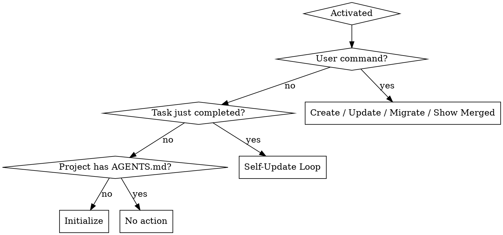

# maintaining-agents-md Skill Implementation Plan

> **For agentic workers:** REQUIRED: Use superpowers:subagent-driven-development (if subagents available) or superpowers:executing-plans to implement this plan. Steps use checkbox (`- [ ]`) syntax for tracking.

**Goal:** Create a personal Claude Code skill that owns the full lifecycle of AGENTS.md files — creation, updating, hierarchy enforcement, self-improvement, and migration.

**Architecture:** Three markdown files in `~/.claude/skills/maintaining-agents-md/`. SKILL.md is the compact core (~300 words) with decision flowchart and hard rules. Two reference files provide hierarchy merge logic and the canonical template. The skill is purely instructional — no executable code.

**Tech Stack:** Markdown with YAML frontmatter (Claude Code skill format)

**Spec:** `docs/superpowers/specs/2026-03-16-maintaining-agents-md-design.md`

---

## Chunk 1: Skill Files

### Task 1: Create directory and SKILL.md

**Files:**
- Create: `~/.claude/skills/maintaining-agents-md/SKILL.md`

- [ ] **Step 1: Create the skill directory**

```bash
mkdir -p ~/.claude/skills/maintaining-agents-md
```

- [ ] **Step 2: Write SKILL.md**

Write the core skill file with YAML frontmatter and the following structure. Target ~300 words. The file must contain:

1. **Frontmatter** — name: `maintaining-agents-md`, description starting with "Use when..." (triggering conditions only, no workflow summary)
2. **Overview** — one-sentence core principle
3. **Decision flowchart** — `dot` digraph selecting between four modes: Create, Update/Migrate, Self-Update, Initialize
4. **Hard rules** — the four non-negotiable rules from the spec (approval required, Commands first, <150 lines, no redundancy)
5. **Mode summaries** — 2-3 sentences each for Create, Update/Migrate, Self-Update, Initialize. Reference `hierarchy-rules.md` and `file-template.md` instead of inlining details
6. **CLAUDE.md relationship** — bootstrap source only, never modify/delete CLAUDE.md
7. **Non-interactive behavior** — skip self-update in `--print` mode, append to PR description instead
8. **Approval pattern** — conversational (present diff, ask in natural language); if user ignores, drop silently; never re-propose declined changes in same session

Content for SKILL.md:

```markdown
---
name: maintaining-agents-md
description: Use when creating, updating, or reviewing AGENTS.md files, when starting work in a new directory, or after completing tasks that revealed new commands, conventions, or boundaries
---

# Maintaining AGENTS.md

## Overview

AGENTS.md files give AI agents the project-specific context they need to work effectively. This skill owns their full lifecycle — creation, updating, hierarchy enforcement, and self-improvement.

**Core principle:** Every project should have a well-structured AGENTS.md. The agent maintains these files as a living document, proposing updates after every task.

## Mode Selection



## Hard Rules

1. **Never write without explicit user approval** — present diff, ask conversationally, wait for response. If user ignores the proposal and asks something else, drop it silently.
2. **Commands section is always first** — every AGENTS.md follows the canonical section order from file-template.md
3. **Files must stay under 150 lines** — if longer, extract content to reference docs
4. **No redundancy across hierarchy** — child files must not repeat rules from parent files

## Modes

### Create
Walk the directory tree. Identify whether root or nested AGENTS.md is needed. Generate from skeleton in file-template.md. Validate against hierarchy-rules.md before presenting to user.

### Update / Migrate
Read existing AGENTS.md, propose diff with one-sentence justification. For migration from non-standard formats, use the section mapping table in file-template.md to restructure while preserving all content.

### Self-Update Loop
After completing any task in an **interactive session**, ask: "Did I learn a new command, convention, or boundary?" If yes:
1. Generate diff against nearest AGENTS.md
2. Check hierarchy for conflicts/redundancy (see hierarchy-rules.md)
3. Present diff + one-sentence justification
4. If approved → write, then re-validate hierarchy
5. If declined → do not re-propose in this session

**Non-interactive mode** (`claude --print`): skip proposals entirely. Append learned conventions as comments in the PR description for human review.

### Initialize
On first encounter with a project lacking AGENTS.md:
1. Check for `~/.claude/AGENTS.md` — offer to create global defaults if missing
2. Read existing CLAUDE.md, package.json, Makefile for bootstrap context (never modify CLAUDE.md)
3. Generate draft following file-template.md skeleton
4. Present for approval

## What Counts as "Learned Something"
- Build/test/lint command not in Commands section
- Convention not documented (import style, naming, forbidden pattern)
- Architectural boundary (module X should never import from Y)
- Gotcha that would trip up future agents

## Proposal Format

```
AGENTS.md update proposal (<path>)
Reason: <one sentence>

<git-style diff>

Approve? (y/n)
```
```

- [ ] **Step 3: Verify word count**

Run: `wc -w ~/.claude/skills/maintaining-agents-md/SKILL.md`
Expected: ~300-350 words (excluding frontmatter code blocks)

- [ ] **Step 4: Commit**

```bash
cd /home/user/Personal/agentboard
git add ~/.claude/skills/maintaining-agents-md/SKILL.md
```

Note: this file lives outside the repo. Commit only if git tracks it; otherwise just verify the file exists and is well-formed.

---

### Task 2: Create hierarchy-rules.md

**Files:**
- Create: `~/.claude/skills/maintaining-agents-md/hierarchy-rules.md`

- [ ] **Step 1: Write hierarchy-rules.md**

This file covers the merge algorithm, precedence rules, conflict detection, and "show merged" behavior. Content:

```markdown
# Hierarchy Rules

## Merge Algorithm

AGENTS.md files form a hierarchy from global to most-specific:

```
~/.claude/AGENTS.md              (outermost — personal defaults)
  └── project/AGENTS.md          (project root)
       └── packages/ui/AGENTS.md (nested — most specific, wins)
```

Arbitrary depth is supported. The merge walks from `~/.claude/AGENTS.md` through every ancestor directory's AGENTS.md down to the nearest one. Most projects need 2-3 levels.

## Precedence Rules

1. **Deeper file overrides** conflicting sections from parent
2. **"Never Do / Always Ask First"** lists are **appended** across all levels (deduplicated)
3. **Commands** are **merged** — child adds to parent's commands, doesn't replace
4. All other sections: **child overrides parent** when both define the same section

No frontmatter merge directives — merge behavior is determined by section type to avoid polluting files with metadata other tools wouldn't understand.

## Conflict Detection

When creating, updating, or validating AGENTS.md files, actively check for:

| Issue | Action |
|-------|--------|
| Child repeats rule from parent | Warn: "Redundant — already in `<parent path>`, remove from child" |
| Child contradicts parent | Warn: "Conflict — reconcile or add comment explaining the override" |
| File exceeds 150 lines | Warn: suggest splitting content into reference docs |
| Missing Commands section | Warn: "Commands section required (empty is valid — signals 'inherit from parent')" |

## Show Merged

When user asks to see the merged view for the current working directory:

1. Find all AGENTS.md files from `~/.claude/AGENTS.md` down through ancestor directories to the nearest one
2. Apply merge rules: start with global, overlay each deeper file
3. For append sections (Commands, Never Do), concatenate and deduplicate
4. For override sections, use the deepest file's version
5. Output the fully resolved result — **read-only, never written to disk**

## Validation After Write

After any approved write to an AGENTS.md file, re-run conflict detection across the full hierarchy to catch newly introduced redundancy or contradictions.
```

- [ ] **Step 2: Verify file is well-formed**

Read the file back and confirm all sections are present and consistent with the spec.

---

### Task 3: Create file-template.md

**Files:**
- Create: `~/.claude/skills/maintaining-agents-md/file-template.md`

- [ ] **Step 1: Write file-template.md**

This file contains the canonical skeleton, section guidelines, migration mapping, and global defaults template. Content:

```markdown
# AGENTS.md File Template

## Canonical Skeleton

Every AGENTS.md must follow this section order. Commands is always first and always required. Other sections can be omitted if not applicable.

```
## Commands
<build, test, lint, deploy — verbatim copy-pasteable commands>

## Project Context
<what this project/package is, one paragraph max>

## Code Style & Conventions
<language, formatting, naming, import rules>

## Testing Requirements
<how to test, what frameworks, coverage expectations>

## Architecture & Boundaries
<key modules, data flow, what not to touch>

## Never Do / Always Ask First
<guardrails — append-merged across hierarchy>

## References
<pointers to docs/, READMEs, external resources>
```

## Section Rules

- **Commands** — always first, always required. An empty Commands section is valid (signals "inherit from parent")
- **No section should exceed ~30 lines** — extract to a reference doc if it does
- **References** replaces inline detail — point to external docs instead of duplicating
- **Referenced filesystem paths** are checked for existence. Missing references are flagged. URLs are not validated.
- **Total file must stay under 150 lines**

## Migration Mapping

When migrating an existing AGENTS.md (or bootstrapping from CLAUDE.md) that uses non-standard section names, map them to canonical sections:

| Existing Section | Maps To |
|-----------------|---------|
| Commands, Scripts, Build | Commands |
| About, Overview, Description | Project Context |
| Do, Style, Conventions, Formatting | Code Style & Conventions |
| Tests, Testing, Test, Coverage | Testing Requirements |
| Architecture, Structure, Modules, Gotchas | Architecture & Boundaries |
| Don't, Never, Forbidden, Warnings | Never Do / Always Ask First |
| Docs, Links, See Also | References |

Unmapped sections: use best-fit canonical section, or Architecture & Boundaries as fallback.

Migration always reorders content to match canonical section order.

## Global Defaults Template

When creating `~/.claude/AGENTS.md` for the first time:

```
## Commands
<!-- empty — project-specific -->

## Code Style & Conventions
<!-- populated from observed patterns if available -->

## Never Do / Always Ask First
- Never commit secrets, credentials, or .env files
- Never force-push to main/master without asking
- Always ask before deleting data or dropping tables
```

This file is intentionally minimal. It provides universal guardrails inherited by all projects unless overridden. Users customize it over time through the self-update loop.
```

- [ ] **Step 2: Verify file is well-formed**

Read the file back and confirm the skeleton, migration table, and global template are all present and consistent with the spec.

- [ ] **Step 3: Commit all skill files**

```bash
cd /home/user/Personal/agentboard
git add -A ~/.claude/skills/maintaining-agents-md/
git commit -m "feat: add maintaining-agents-md skill with hierarchy rules and template"
```

Note: these files live outside the repo at `~/.claude/skills/`. If git doesn't track them, just verify all three files exist:
```bash
ls -la ~/.claude/skills/maintaining-agents-md/
wc -l ~/.claude/skills/maintaining-agents-md/*.md
```

---

## Chunk 2: Verification

### Task 4: Verify skill discovery

- [ ] **Step 1: Check skill is discoverable**

The skill should appear in Claude Code's skill list. Start a new Claude Code session and check if `maintaining-agents-md` appears as an available skill.

If not discoverable, verify:
- Frontmatter has correct `name` and `description` fields
- File is named `SKILL.md` (not `skill.md` or anything else)
- Directory is at `~/.claude/skills/maintaining-agents-md/`

- [ ] **Step 2: Test basic invocation**

In a Claude Code session, say "update AGENTS.md" and verify the skill activates. It should read the current project's AGENTS.md and either propose updates or confirm it's well-structured.

- [ ] **Step 3: Test initialization in a project without AGENTS.md**

Navigate to a directory without AGENTS.md. The skill should offer to create one, bootstrapping from any existing CLAUDE.md or package.json.

---

### Task 5: Validate against spec

- [ ] **Step 1: Cross-reference spec**

Read the spec at `docs/superpowers/specs/2026-03-16-maintaining-agents-md-design.md` and verify every requirement is covered:

- [ ] Four modes (Create, Update/Migrate, Self-Update, Initialize)
- [ ] Hierarchy merge algorithm with append/override per section type
- [ ] Conflict detection (redundancy, contradictions, line limits, missing Commands)
- [ ] Migration mapping table
- [ ] Global layer at `~/.claude/AGENTS.md`
- [ ] CLAUDE.md relationship (bootstrap only)
- [ ] Non-interactive behavior
- [ ] Conversational approval pattern
- [ ] Canonical section order enforced
- [ ] 150-line file limit
- [ ] Show merged command
- [ ] Self-update proposal format

- [ ] **Step 2: Commit plan**

```bash
cd /home/user/Personal/agentboard
git add docs/superpowers/plans/2026-03-16-maintaining-agents-md.md
git commit -m "docs: add implementation plan for maintaining-agents-md skill"
```
